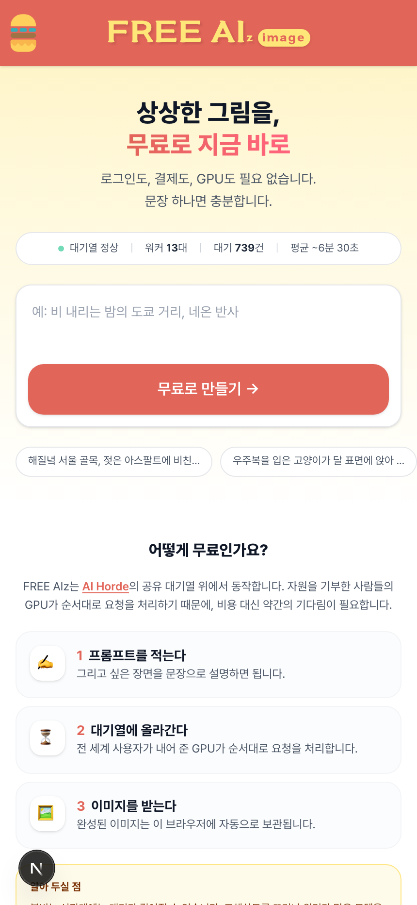
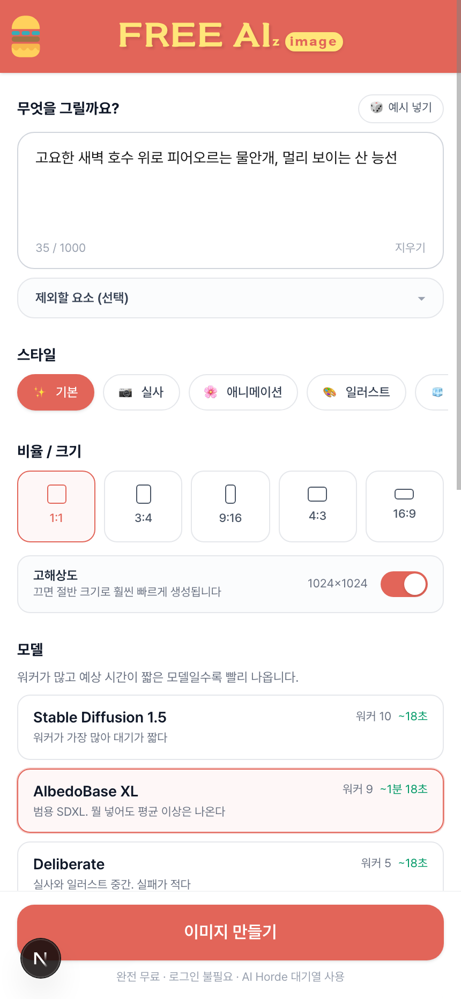
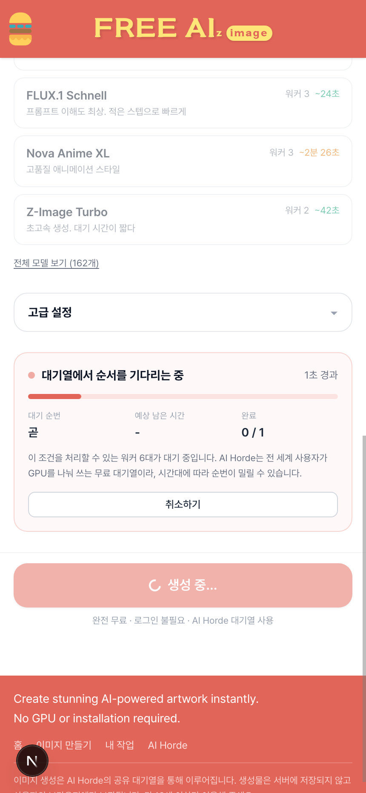
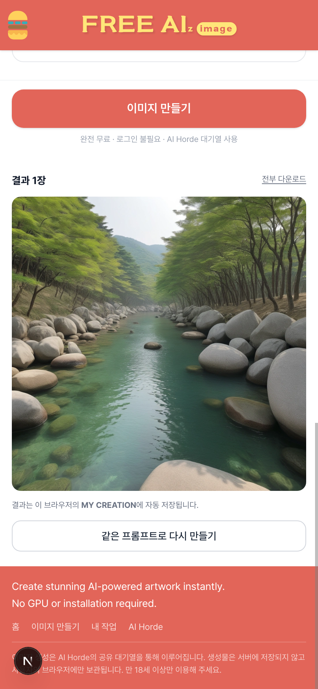
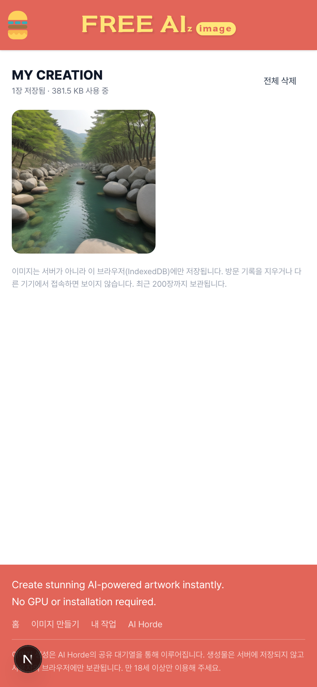

# FREE AIz

AI Horde를 한번 써보려고 만든 이미지 생성 웹.

무료로 이미지 생성이 되는 API가 뭐가 있나 찾다가 [AI Horde](https://aihorde.net)를 알게 됐다.
전 세계 사람들이 자기 GPU를 내놓고 그걸 큐로 돌려 쓰는 크라우드소싱 방식이라 진짜로 공짜고,
가입도 결제도 필요 없다. 익명 키(`0000000000`)만 있으면 바로 요청을 넣을 수 있다.

그래서 그냥 API만 찔러보고 끝내지 말고 서비스처럼 붙여보자 싶어서 만들었다.

## 결론부터

**연동이랑 UI는 다 됐는데, 대기열이 너무 길어서 실사용은 접었다.**

익명 키는 우선순위가 제일 낮다. Horde는 kudos(기여도 포인트) 순으로 큐를 처리하는데,
아무것도 기여 안 한 익명 요청은 계속 뒤로 밀린다. 실제로 찍어본 수치는 이랬다.

- 512px / 12스텝 / 워커 많은 모델(`stable_diffusion`) → 25초쯤
- 1024px SDXL 계열 → 보통 몇 분, 붐빌 땐 10분 넘겨서 요청이 만료됨
- 홈에서 보여주는 호드 전체 상태 기준으로 워커 13대에 대기 579건, 평균 7분대

혼자 테스트할 땐 참을 만한데, 남한테 "여기서 이미지 만들어봐" 하고 보여줄 물건은 못 된다.
쓸 만한 속도를 내려면 결국 kudos를 벌어야 하고(= 내 GPU로 남의 요청을 처리해줘야 하고),
그럼 애초에 "설치 없이 무료로" 라는 전제가 깨진다.

돌아가긴 다 돌아간다. 속도만 문제다.

## 화면

| 홈 | 생성 |
|---|---|
|  |  |

| 대기열 | 결과 |
|---|---|
|  |  |



## 되는 것

프롬프트 쓰고, 스타일(실사/애니/일러스트 등) 고르고, 비율이랑 해상도 정하고, 모델 고르면 생성된다.
모델 목록은 Horde에서 실시간으로 받아와서 각 모델에 워커가 몇 대 붙어 있고 예상 대기가 얼마인지 같이 보여준다.
이게 있어야 어느 모델을 골라야 안 굶는지 알 수 있다.

생성 중에는 대기 순번, 예상 남은 시간, 경과 시간이 계속 갱신되고 중간에 취소할 수 있다.

결과 이미지는 IndexedDB에 저장한다. Horde가 주는 이미지는 R2 링크로 오는데 수명이 짧아서
그냥 URL만 들고 있으면 나중에 다 깨진다. 그래서 결과 받는 즉시 blob으로 받아서 넣어둔다.
서버에는 아무것도 안 남고 브라우저에만 있다.

고급 설정으로 스텝, CFG, 샘플러, 시드, 장수, hires fix 같은 걸 만질 수 있다.
FLUX나 Turbo 계열처럼 권장 파라미터가 정해진 모델은 값을 강제로 덮어쓴다. 안 그러면 결과가 망가진다.

## 구조

```
src/
  lib/horde/       Horde API 타입, 클라이언트, 페이로드 빌더, 설정 모델
  lib/storage/     IndexedDB 보관소
  hooks/           생성 폴링 상태 머신, 모델 목록, 보관함
  pages/api/horde/ Horde 프록시 (generate / status / models / performance / image)
  components/      화면
```

Horde를 브라우저에서 직접 부르지 않고 Next API 라우트로 한 번 감쌌다.
API 키를 클라이언트에 안 흘리려는 것도 있고, R2 이미지가 CORS에 걸리는 경우가 있어서
프록시가 필요했다. 모델 목록 같은 건 여기서 캐시한다.

생성 흐름은 `POST /generate/async`로 요청 ID 받고 → `/generate/check/{id}`로 폴링 →
`done` 되면 `/generate/status/{id}`로 이미지까지 받아오는 식이다.
폴링에 status를 쓰면 매번 이미지가 딸려와서 대역폭이 낭비되니까 check를 쓴다.

## 실행

```bash
npm install
npm run dev
```

환경변수는 없어도 된다. 익명 키로 동작한다.
Horde 계정이 있으면 `.env.local`에 키를 넣으면 우선순위가 올라간다.

```
HORDE_API_KEY=본인키
```

## Horde 붙이면서 알게 된 것들

문서에 안 적혀 있거나 적혀 있어도 헤매기 쉬운 것들. 나중에 또 만질 일 있으면 보려고 적어둔다.

**negative prompt 필드가 없다.** `negative_prompt`를 따로 보내는 게 아니라
`prompt` 한 문자열 안에 `긍정 프롬프트 ### 부정 프롬프트` 형식으로 넣어야 한다.
스펙 전체 뒤져도 `negative_prompt`라는 키는 없다.

**seed는 숫자가 아니라 문자열이다.** 스펙상 string이고 실제로 텍스트도 받는다.

**clip_skip을 고정하면 안 된다.** 모든 요청에 `clip_skip: 1`을 박아뒀더니
모델에 따라 `ClipSkipMismatch`로 거부당했다. 모델마다 허용 값이 달라서, 굳이 안 쓸 거면
아예 안 보내는 게 맞다.

**`censor_nsfw: true`는 지뢰다.** SFW 요청인데 워커의 안전 필터가 오탐하면
이미지 대신 검은 바탕에 "CENSORED"라고 적힌 판이 온다. "a red apple on a wooden table"로
테스트하다 이걸 받고 한참 헤맸다. API 기본값도 `false`라서 그냥 기본값 쓰는 게 낫다.

**해상도는 64의 배수여야 한다.** 아니면 `InvalidSize`.

**요청은 10분 지나면 만료된다.** 그 안에 워커가 안 잡으면 그냥 사라진다.
큐가 밀릴 때 실제로 자주 겪는다.

**`Client-Agent` 헤더를 `이름:버전:연락처` 형식으로 보내야 한다.** 안 보내면 unknown으로 잡힌다.

## 안 한 것

- img2img, inpainting, ControlNet. Horde는 다 지원하는데 안 붙였다.
- 계정/서버 저장. 전부 브라우저 로컬이다. 기기 바꾸면 그림 다 날아간다.
- `package.json`에 firebase가 들어있는데 안 쓴다. 처음에 서버 저장 생각했다가 접었다.
